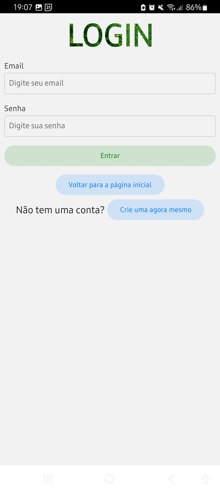
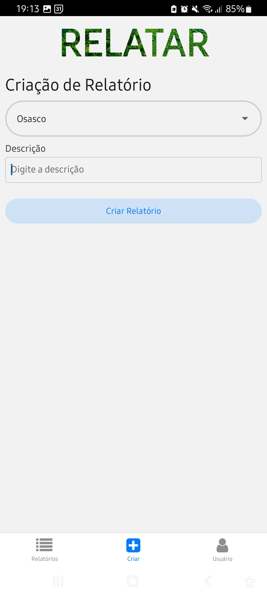

# GS - Protech The Future | Mobile

## Integrantes

| Nome                   |   RM   |
| :--------------------- | :----: |
| Otavio Miklos Nogueira | 554513 |
| Luciayla Yumi Kawakami | 557987 |

## Links

- Youtube: 

## Descrição 

## Instruções

### Instalação

1. Clone o repositório do projeto:
   1. HTTPS: `git clone https://github.com/omininola/gs_mobile.git`
   2. SSH: `git@github.com:omininola/gs_mobile.git`
2. Entre no diretório do projeto: `cd gs_mobile`
3. Instale as dependências: `npm install`

### Incialização

#### Rode o projeto: `npm start`

**A resposta da API de Java pode demorar devido ao deploy gratuito na plataforma Render**

##### Caso tenha um Emulador Android

1. Vá no terminal e pressione `a` para inicializar o emulador

##### Caso não tenha um Emulador Android

1. Instale o Expo Go no seu celular
   1. Android: https://play.google.com/store/apps/details?id=host.exp.exponent
   2. IOS: https://apps.apple.com/br/app/expo-go/id982107779
2. Volte no terminal e pressione `s` para mudar de "development build" para "Expo Go"
3. Leia o QR Code com a câmera do seu celular

### Navegação

O aplicativo possui várias funcionalidades, logo de cara você pode acessar a tela de `Dashboard` para verificar a situação dos nossos sensores que estão acoplados aos drones que detectam fogo.

Aleḿ disso, você pode criar uma nova conta caso não tenha uma, ou entrar em uma conta já existente. Isso te garante acesso as demais páginas, como a de usuário, relatórios e criação de novos relatórios.

Aqui estão algumas imagens que representam essas telas

#### Home

#### Cadastro

#### Login

#### Usuário

#### Relatórios

#### Criar Relatório

